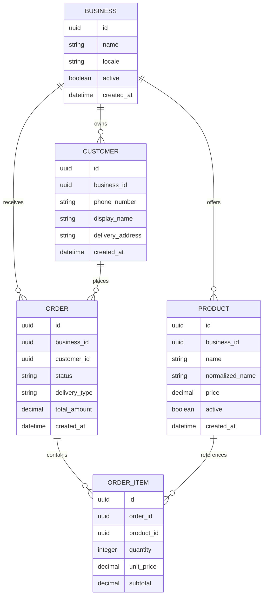

# Data Model Diagram

```mermaid
erDiagram
    BUSINESS ||--o{ CUSTOMER : owns
    BUSINESS ||--o{ PRODUCT : offers
    BUSINESS ||--o{ ORDER : receives
    CUSTOMER ||--o{ ORDER : places
    ORDER ||--o{ ORDER_ITEM : contains
    PRODUCT ||--o{ ORDER_ITEM : references

    BUSINESS {
        uuid id
        string name
        string locale
        boolean active
        datetime created_at
    }

    CUSTOMER {
        uuid id
        uuid business_id
        string phone_number
        string display_name
        string delivery_address
        datetime created_at
    }

    PRODUCT {
        uuid id
        uuid business_id
        string name
        string normalized_name
        decimal price
        boolean active
        datetime created_at
    }

    ORDER {
        uuid id
        uuid business_id
        uuid customer_id
        string status
        string delivery_type
        decimal total_amount
        datetime created_at
    }

    ORDER_ITEM {
        uuid id
        uuid order_id
        uuid product_id
        integer quantity
        decimal unit_price
        decimal subtotal
    }
```
