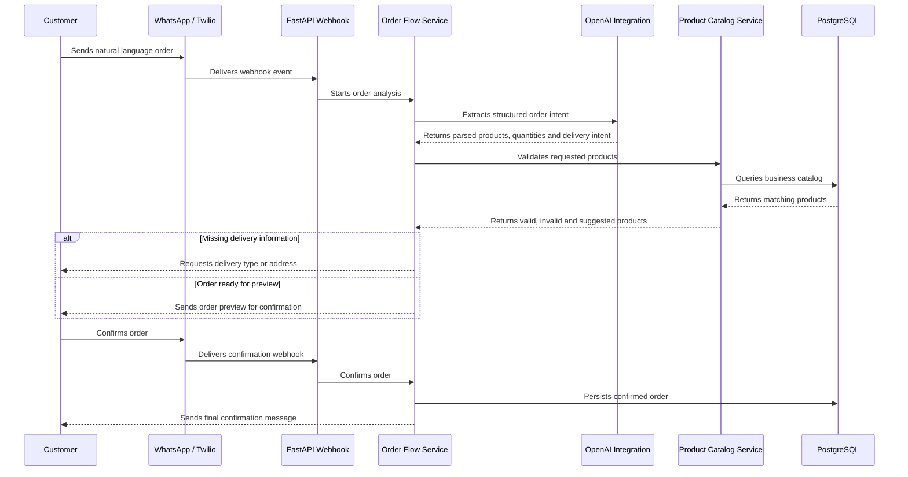

# Order Flow Sequence Diagram

```mermaid
sequenceDiagram
    participant Customer as Customer
    participant WhatsApp as WhatsApp / Twilio
    participant API as FastAPI Webhook
    participant Flow as Order Flow Service
    participant AI as OpenAI Integration
    participant Catalog as Product Catalog Service
    participant DB as PostgreSQL

    Customer->>WhatsApp: Sends natural language order
    WhatsApp->>API: Delivers webhook event
    API->>Flow: Starts order analysis

    Flow->>AI: Extracts structured order intent
    AI-->>Flow: Returns parsed products, quantities and delivery intent

    Flow->>Catalog: Validates requested products
    Catalog->>DB: Queries business catalog
    DB-->>Catalog: Returns matching products
    Catalog-->>Flow: Returns valid, invalid and suggested products

    alt Missing delivery information
        Flow-->>Customer: Requests delivery type or address
    else Order ready for preview
        Flow-->>Customer: Sends order preview for confirmation
    end

    Customer->>WhatsApp: Confirms order
    WhatsApp->>API: Delivers confirmation webhook
    API->>Flow: Confirms order

    Flow->>DB: Persists confirmed order
    Flow-->>Customer: Sends final confirmation message
```
